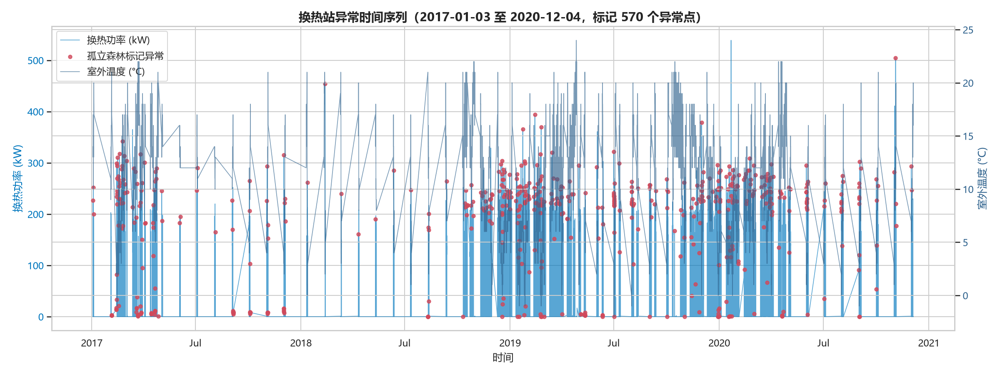
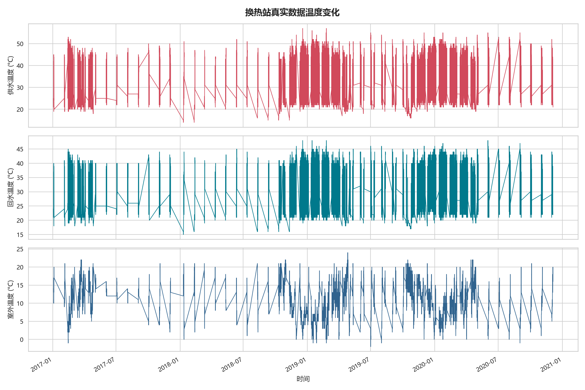
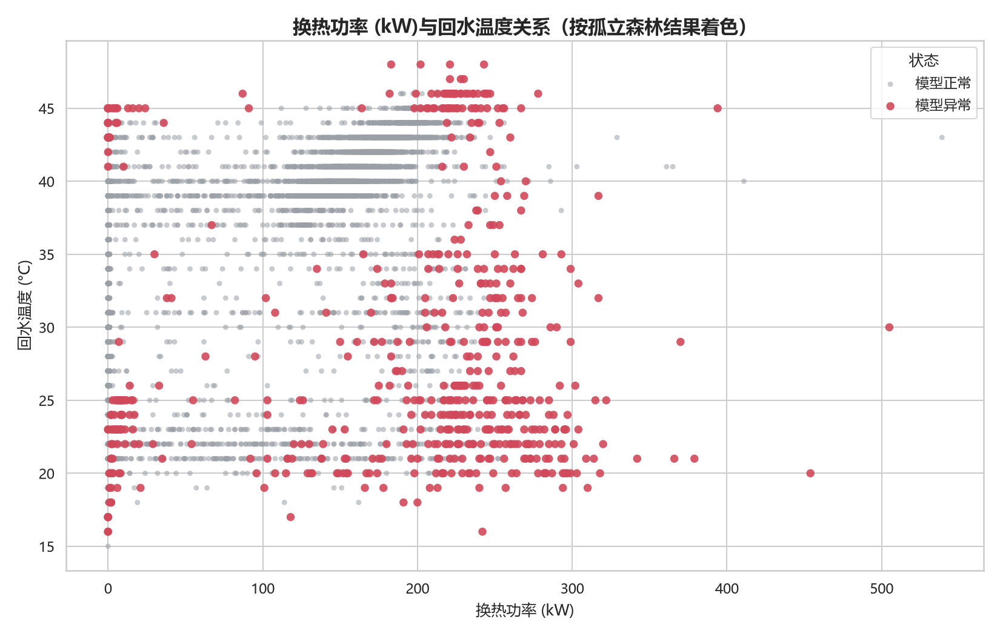

# Heat-Exchange-Station-Anomaly-Detection

> 基于孤立森林的换热站异常工况检测原型验证

## 项目状态

[](#版本历史)
[](#项目定位)

## 项目背景

供热系统中的跑冒滴漏和水力失调可能造成流量异常、供回水温差异常以及能源浪费。仅依靠人工巡检难以及时发现持续时间较短或多变量共同变化的异常工况，因此需要利用传感器数据进行辅助分析。

本项目选择孤立森林作为初版无监督方法，因为它不要求大量历史故障标签，能够直接在多变量传感器特征上识别相对孤立的样本，适合用于算法原型验证。

## 项目定位

本项目是一个面向换热站场景的 Python 算法原型，支持“模拟数据生成”以及“读取 DHS 换热站真实 CSV”两种模式，并完成可视化分析和孤立森林检测。

当前阶段为原型验证阶段。真实数据模式只负责离线读取、字段适配和异常点标记，不包含真实故障标签或在线告警闭环。

**本项目不适用于生产环境。** 当前版本没有真实数据接入、数据质量管理、在线推理、告警闭环、权限控制、模型监控或安全保障能力，不能直接用于生产供热系统的自动控制和故障决策。

## 快速开始

### 环境要求

- Windows、Linux 或 macOS
- Python 3.9 或更高版本
- 当前已在 Python 3.13.14 环境中运行验证

查看 Python 版本：

```powershell
python --version
```

### 安装依赖

在项目根目录创建虚拟环境：

```powershell
python -m venv .venv
```

激活虚拟环境：

```powershell
# Windows PowerShell
.\.venv\Scripts\Activate.ps1
```

```bash
# Linux/macOS
source .venv/bin/activate
```

安装项目依赖：

```powershell
python -m pip install --upgrade pip
python -m pip install pandas numpy matplotlib seaborn scikit-learn
```

### 运行项目

默认使用 `auto` 模式：如果存在 `data/raw/PodstanicaL8.csv`，优先读取真实数据；否则使用模拟数据。

```powershell
python .\heat_exchange_simulation.py
```

明确使用真实 CSV：

```powershell
python .\heat_exchange_simulation.py --source real --input .\data\raw\PodstanicaL8.csv
```

明确使用模拟数据：

```powershell
python .\heat_exchange_simulation.py --source simulated
```

运行完成后，CSV 文件和 PNG 图片会保存到脚本所在目录。

## 方法说明

### 数据生成逻辑

脚本生成 15 天、15 分钟粒度的模拟数据：

- 时间范围：`2026-11-15 00:00:00` 至 `2026-11-29 23:45:00`
- 总行数：1440 行
- 随机种子：42
- 室外温度：使用日周期函数模拟凌晨低温和下午高温，并叠加平滑天气变化与高斯噪声
- 供水温度：根据室外温度反向变化，室外越冷，供水温度越高
- 回水温度：使用上一时刻供水温度构造 15 分钟滞后响应
- 室内温度：使用一阶惯性形式模拟，避免瞬时噪声造成不合理跳变

脚本注入两段异常，每段持续 4 小时、共 16 行：

| 异常类型 | 时间段 | 注入特征 |
| --- | --- | --- |
| 跑冒滴漏 | 2026-11-17 14:00 至 17:45 | `flow_rate` 提高约 40%，`return_temp` 降低约 6.5℃，`supply_temp` 不主动修改 |
| 水力失调 | 2026-11-22 08:00 至 11:45 | `return_temp` 降低约 18℃，`valve_opening` 提高约 22%，`flow_rate` 降低约 42% |

### 真实数据读取与字段适配

本仓库使用的真实数据来源于 [Kaggle DHS Substation Data 公开数据集](https://www.kaggle.com/datasets/milanzdravkovic/dhs-substation-data)，即 DHS（District Heating System，区域供热系统）运行数据，包含二次网供/回水温度、换热功率及室外温度等逐时记录。

真实数据文件为 `data/raw/PodstanicaL8.csv`，包含 11,399 条小时级记录。脚本读取后使用以下字段映射：

| 原始列 | 统一列 | 含义 |
| --- | --- | --- |
| `datum` | `timestamp` | 日期时间，按日/月/年解析 |
| `tsp` | `outside_temp` | 室外温度 |
| `tns` | `supply_temp` | 二次侧供水温度 |
| `tps` | `return_temp` | 二次侧回水温度 |
| `qizm` | `heat_power` | 换热功率/传输热量，单位：kW |

这份真实 CSV 没有阀门开度、室内温度和人工故障标签，因此脚本不会伪造这些字段。少量参与模型的缺失值会进行时间序列插值，`fault_type` 设置为 `未标注`。

### 特征工程

模拟数据模式使用以下原始传感器特征及供回水温差训练孤立森林：

```text
supply_temp
return_temp
temp_diff
flow_rate
valve_opening
outside_temp
```

真实数据模式使用实际存在且完成插值的特征，并额外构造供回水温差：

```text
supply_temp
return_temp
temp_diff
heat_power
outside_temp
```

其中，`temp_diff = supply_temp - return_temp`，用于显式表达换热站供回水温差这一物理关系，帮助模型区分温度水平变化和供热工况异常。`indoor_temp`、`valve_opening` 和 `timestamp` 不参与当前孤立森林训练。真实数据没有 `flow_rate`，因此散点图横轴自动使用 `heat_power`。

### 模型选型与参数

模型使用 `sklearn.ensemble.IsolationForest`，配置如下：

```python
IsolationForest(
    contamination=0.05,
    random_state=42,
    n_estimators=200,
)
```

预测结果写入 `iforest_prediction` 列：

- `1`：模型判定为正常
- `-1`：模型判定为异常

## 实验结果

### 异常时间序列图

这是本项目最直接的结果图：它将换热功率或流量、室外温度和孤立森林标记的异常点放在同一时间轴上，用于观察异常点是否集中出现、是否伴随运行变量突变。



### 检测汇总表

在当前固定随机种子和已验证依赖版本下，运行结果如下：

| 指标 | 结果 |
| --- | ---: |
| 总数据量 | 1440 |
| 注入异常点数量 | 32 |
| 跑冒滴漏点数量 | 16 |
| 水力失调点数量 | 16 |
| 模型标记异常点数量 | 72 |
| 被模型召回的注入异常点数量 | 32 |
| 注入异常召回率 | 100.00% |
| 精确率（Precision） | 44.44% |

精确率的含义是：模型标出的 72 个异常点中，有 32 个是脚本注入的真实异常，即 `32 / 72 = 44.44%`。

模拟数据中 44.44% 的精确率表明，无监督孤立森林会产生较多误报（虚警）。这也明确了下一步的优化方向：引入供热系统物理规则，例如供水温度变化率阈值和异常持续时长过滤，减少误报，而不是单纯依赖统计模型。

当前结果说明模型能够识别本次人工注入的明显异常，但也产生了较多额外异常点。`100%` 召回率只适用于这批固定的模拟数据，不能作为真实生产环境的性能承诺。

真实 DHS CSV 的首次测试结果如下：

| 指标 | 结果 |
| --- | ---: |
| 数据量 | 11,399 |
| 数据粒度 | 小时级 |
| 模型使用特征 | `supply_temp`、`return_temp`、`temp_diff`、`heat_power`、`outside_temp` |
| 模型标记异常点数量 | 570 |
| 故障标签 | 无 |
| 召回率 | 不计算 |

真实数据没有人工故障标签，因此 `570` 个异常点只是模型结果，不能直接解释为 570 个真实故障。加入 `temp_diff` 后，模型显式使用供回水温差这一物理关系，但仍需要维护记录或人工复核来判断异常是否真实。

### 可视化图表

温度趋势图包含供水温度、回水温度和室外温度的变化曲线；模拟数据为 15 天，真实数据按实际时间范围绘制：



散点图在模拟模式下按故障标签展示流量与回水温度的关系；在真实数据模式下，由于没有人工故障标签，按孤立森林预测结果区分模型正常点和模型异常点，并展示换热功率与回水温度的关系：



## 不足与改进方向

当前限制：

- 真实 CSV 的列名和物理含义依赖数据集说明，当前只适配 `PodstanicaL8.csv` 的已确认字段。
- 真实 CSV 没有故障标签，无法直接计算召回率、精确率或 F1-score。
- 异常模式较简单，暂未模拟传感器漂移、缺失值、通信中断和多故障重叠。
- 当前模型只使用原始特征，没有使用供回水温差、变化率和滑动统计等更有业务含义的派生特征。
- `contamination=0.05` 是人为设定的先验比例，不一定适合真实数据。
- 当前评估依赖脚本中人为注入的 `fault_type` 标签，尚未使用独立测试集或人工标注数据。
- 当前只输出异常点级别结果，尚未将连续异常点聚合为故障事件。
- 没有实现在线数据接入、告警通知、根因解释和模型监控。

下一步计划：

1. 为真实数据增加人工复核或维护记录，建立可评估的故障标签。
2. 增加供回水温差、温差变化率、流量变化率和滑动统计特征。
3. 对比孤立森林、扩展孤立森林、自编码器和基于物理规律的规则检测。
4. 增加精确率、F1-score、误报率和事件级召回率等指标。
5. 将点级异常聚合为故障事件，并增加异常持续时间和告警等级。
6. 增加规则引擎和根因分析，降低误报并提升结果可解释性。

## 版本历史

| 版本 | 日期 | 关键更新 |
| --- | --- | --- |
| V1.0 | 2026-08-09 | 模拟数据生成、孤立森林原型验证、README 初版 |
| V1.1 | 2026-08-10 | 接入 Kaggle DHS 换热站 CSV，增加真实数据字段适配和自动模式 |
| V1.2 | 2026-08-11 | 增加 `temp_diff` 特征、异常时间序列图、真实数据异常可视化和 Kaggle 来源说明 |
| V1.3 | *计划中* | 增加真实故障标签、业务规则过滤和事件级评估 |

## 项目结构

```text
Heat-Exchange-Station-Anomaly-Detection/
├── heat_exchange_simulation.py
├── README.md
├── data/
│   └── raw/
│       └── PodstanicaL8.csv  # 本地下载，已被 .gitignore 忽略
├── heat_exchange_data.csv
├── heat_exchange_data_with_iforest.csv
└── docs/
    ├── heat_exchange_temperature_trends.png
    ├── heat_exchange_flow_return_scatter.png
    └── heat_exchange_anomaly_timeline.png
```

其中，`PodstanicaL8.csv` 是本地下载的第三方原始数据，不应提交到仓库；`docs/` 中的三张图是用于 README 展示的可复现可视化产物。

根目录下的 CSV 和其他运行产物仍通过 `.gitignore` 排除。

## 技术栈

- Python 3.9+
- `pandas`：时间序列和表格数据处理
- `numpy`：数值计算和随机数据生成
- `matplotlib`：基础绘图
- `seaborn`：统计可视化样式和散点图绘制
- `scikit-learn`：`IsolationForest` 异常检测

当前脚本不使用 `openpyxl`，因此运行本项目不需要安装该库。
